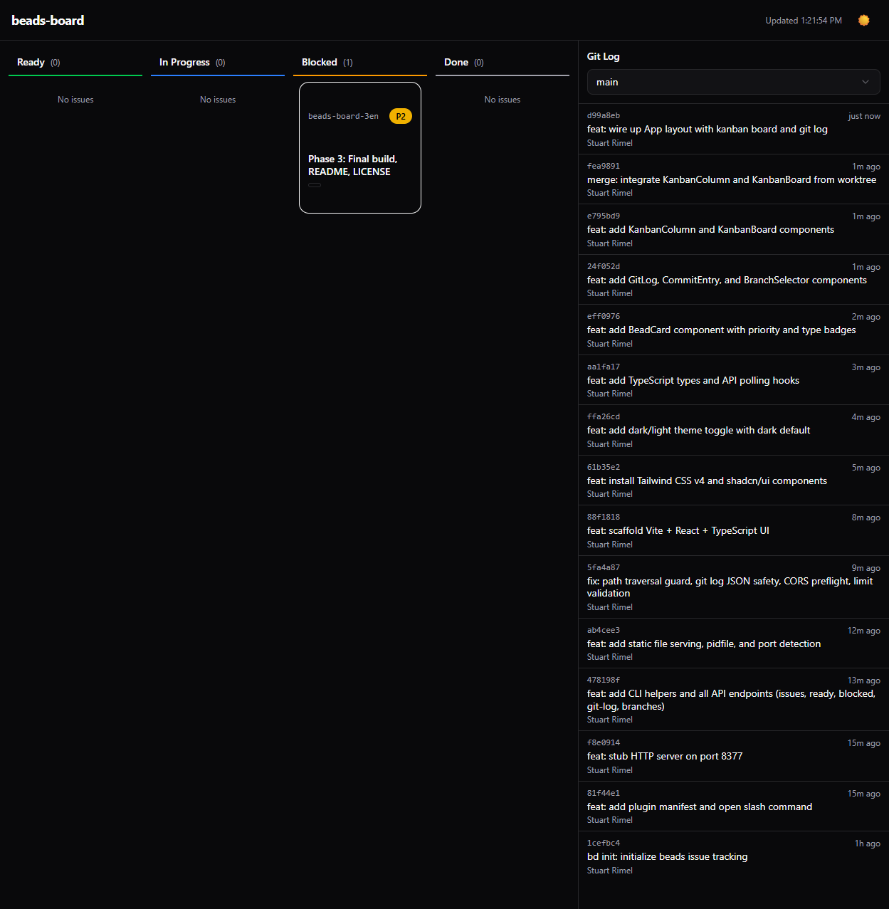

# beads-board

A minimal kanban dashboard and git log viewer for [Beads](https://github.com/steveyegge/beads), powered by Claude Code skills.



## Features

- **Kanban board** — Issues organized by status: Ready, In Progress, Blocked, Done
- **Git log** — Scrollable commit history with branch selector
- **Bead ID linking** — Bead IDs in commit messages are highlighted as badges
- **Dark/light theme** — Toggle between themes, dark by default
- **Auto-refresh** — Polls for updates every 5 seconds
- **Zero runtime dependencies** — Server uses only Node.js stdlib

## Quick Start

### As a Claude Code Skill

Place the `beads-board-start` and `beads-board-stop` skills in your project's `.claude/skills/` directory, then:

```
/beads-board-start    # Start the dashboard server
/beads-board-stop     # Stop it
```

### Manual Usage

```bash
# From any directory with a .beads/ project
node server/index.js

# Or specify a project directory
node server/index.js /path/to/your/project
```

Then open **http://localhost:8377** in your browser.

The server auto-detects an available port starting from 8377. If a server is already running, it prints the existing URL instead of starting a duplicate.

## How It Works

The server shells out to `bd` and `git` CLI commands to fetch data, then serves a React dashboard that polls the API every 5 seconds. No direct database access — all data flows through the Beads CLI.

```
Browser  →  GET /api/*  →  Node.js server  →  bd/git CLI  →  JSON response
         ←  React app   ←  server/dist/
```

See [docs/architecture.md](docs/architecture.md) for details.

## Documentation

- [Architecture](docs/architecture.md) — How the server, UI, and plugin fit together
- [API Reference](docs/api.md) — All API endpoints with examples
- [Contributing](docs/contributing.md) — How to set up a dev environment and make changes

## License

[MIT](LICENSE)
